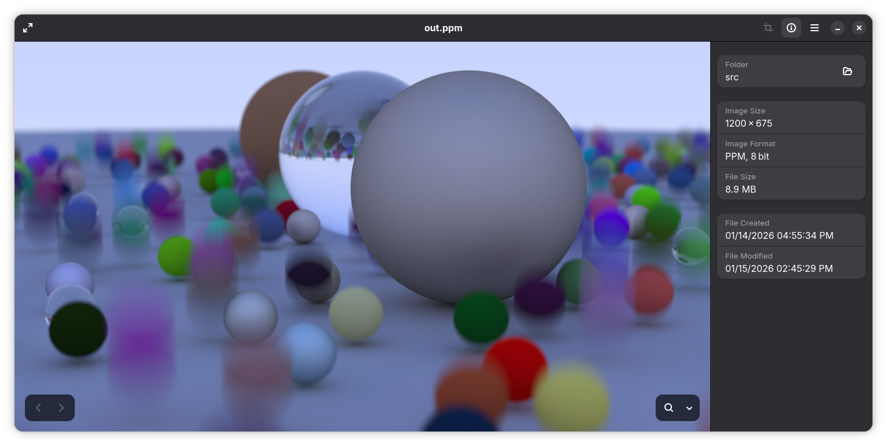

# raytracing-zig

the Raytracing series of books implemented in Zig

currently following Raytracing the Next Week, output is right after finishing motion blur

**NOTE:** this project was made with Zig master (0.16.0-dev).

### features

- multi-threaded tiled raytracing, can configure amount of cores used in main.zig
- can output directly to a file; no need to redirect
