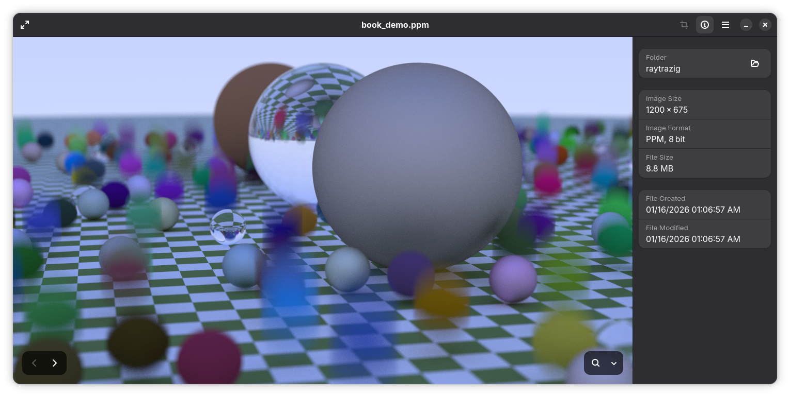

psst, if you're in GitHub, this repository is [mirrored from Codeberg](https://codeberg.org/thacuber2a03/raytrazig)

---

# raytrazig

the Raytracing series of books implemented in Zig

currently following Raytracing the Next Week, output is right after finishing textures

**NOTE:** this project was made with Zig master (0.16.0-dev).

<!-- the lack of *anything* in master is annoying. I really should switch to 0.15.2... -->

### features

- multi-threaded tiled raytracing, can configure amount of cores used in main.zig
- can output directly to a file; no need to redirect
- CLI to check the demos out and mess with them; no load-from-config-file yet, might do that eventually
